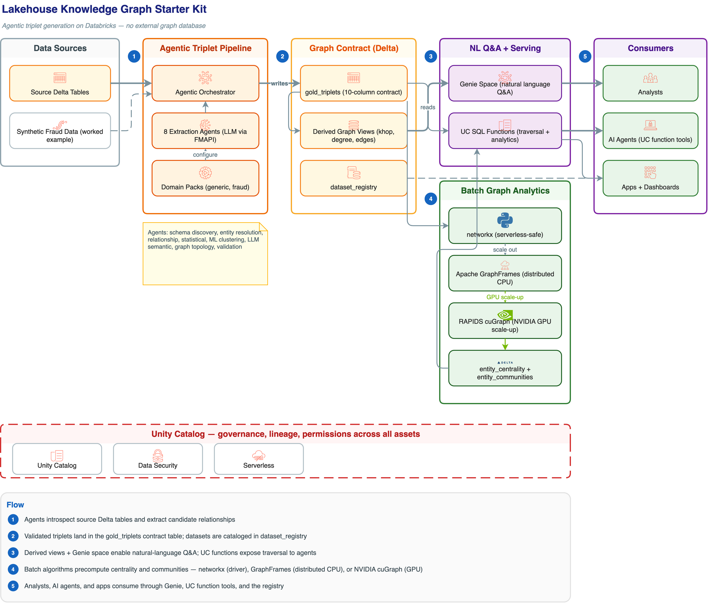

# Lakehouse Knowledge Graph Starter Kit

Foundational tooling for building knowledge graphs on Databricks — no external graph
database required. An agentic pipeline discovers and generates triplets from your Delta
tables; templates then make the graph queryable through Genie (natural language), Unity
Catalog SQL functions (agent tools), and batch graph algorithms (CPU or NVIDIA GPU).



Everything reduces to one contract: a `gold_triplets` Delta table. Any data team that can
produce that table — with this pipeline or their own — gets the entire consumption layer
(Genie space, traversal functions, analytics functions, graph algorithms) for free.

## What's in the box

| Layer | Assets |
|---|---|
| Triplet generation | `lakehouse_kg/` Python package: 8-agent orchestrator with pluggable domain packs |
| Data model | `sql/01_gold_triplets.sql`, `sql/02_dataset_registry.sql` |
| Genie space | `notebooks/03_derive_graph_views.py`, `notebooks/04_create_genie_space.py` (REST automation) |
| Graph-algo UC functions | `sql/03_traversal_functions.sql`, `sql/04_analytics_functions.sql`, `notebooks/05_register_uc_functions.py` |
| Batch algorithms | `notebooks/06_graph_algorithms.py` (networkx, serverless-safe), `notebooks/07_cugraph_gpu.py` (NVIDIA RAPIDS cuGraph), `notebooks/08_graphframes_distributed.py` (Apache GraphFrames, distributed CPU) |
| Worked example | Synthetic fraud dataset (`notebooks/01_synthetic_data.py`) + fraud domain pack |
| Diagram | `docs/architecture.drawio` (editable in draw.io / Lucidchart), `docs/architecture.png` |

## Quick start

Clone the repo into your workspace (Repos or Workspace Files), then run the notebooks in
order. All notebooks are parameterized with widgets — defaults target
`main.knowledge_graph`.

1. **`01_synthetic_data`** — generate the fraud worked example (skip if you have your own tables).
2. **`02_triplet_pipeline`** — run the 8-agent pipeline; pick a domain pack (`generic` or `fraud`). Writes `gold_triplets` + `agent_execution_log`.
3. **`03_derive_graph_views`** — derive `edges_enriched`, `nodes_derived`, `downstream_khop`, `upstream_khop`, `node_degree` views over `gold_triplets` (or any node/edge table pair you configure).
4. **`04_create_genie_space`** — create/update a Genie space over those views via the REST API, seeded with instructions, sample questions, and example SQL.
5. **`05_register_uc_functions`** — register 8 UC SQL functions (traversal + analytics serving).
6. **`06_graph_algorithms`** — precompute PageRank, degree, betweenness, Louvain communities, connected components into `entity_centrality` + `entity_communities` (networkx on the driver; guarded for graphs up to ~5M edges).
7. **`07_cugraph_gpu`** — GPU scale-up alternative to 06: same outputs, computed with NVIDIA RAPIDS cuGraph (`cluster_specs/gpu_cugraph.json` has a ready cluster spec).
8. **`08_graphframes_distributed`** — distributed-CPU scale-out alternative to 06: same outputs via Apache GraphFrames on an ML-runtime cluster (`cluster_specs/classic_graphframes.json`), where GraphFrames ships pre-installed. Label propagation stands in for Louvain; betweenness is written as NULL.

## The triplet contract

`gold_triplets` — one row per discovered relationship:

| Column | Type | Meaning |
|---|---|---|
| `subject_id` / `subject_type` | STRING | Source entity and its type |
| `predicate` | STRING | Relationship type (`OWNS_ACCOUNT`, `MEMBER_OF_COMMUNITY`, …) |
| `object_id` / `object_type` | STRING | Target entity and its type |
| `confidence` | DOUBLE | 0.0–1.0; boosted when multiple agents corroborate |
| `source_agent` / `source_method` | STRING | Which agent and technique produced the row |
| `properties` | STRING | JSON metadata (scores, reasoning, amounts) |
| `created_at` | TIMESTAMP | Generation time |

`dataset_registry` holds one row per onboarded dataset (display name, triplet table FQN,
sample prompts, optional agent endpoint) so multiple graphs can share one deployment of
the consumption layer.

## The agentic pipeline

Eight agents each ask a different question of the data:

| Phase | Agent | Question |
|---|---|---|
| Discovery | Schema discovery | What datasets and columns exist? |
| Discovery | Entity resolution | What are the key entities? |
| Generation | Relationship (rule-based) | What direct FK / shared-attribute links exist? |
| Generation | Statistical | What anomalies stand out? |
| Generation | ML clustering | What hidden behavioral clusters exist? |
| Generation | LLM semantic | What can a foundation model infer? |
| Enrichment | Graph topology | What hubs, bridges, and communities emerge? |
| Validation | Validation | Are triplets deduplicated, consistent, corroborated? |

```python
from lakehouse_kg import PipelineConfig, AgenticOrchestrator
from lakehouse_kg.domains import get_domain_pack

config = PipelineConfig(
    catalog="main",
    schema="knowledge_graph",
    domain=get_domain_pack("generic"),   # or "fraud"
    llm_endpoint="databricks-meta-llama-3-3-70b-instruct",
)
summary = AgenticOrchestrator(spark, config).run()
```

### Domain packs

All domain knowledge — entity-type patterns, predicate vocabulary, LLM prompts, Genie
view definitions — lives in a `DomainPack` (`lakehouse_kg/domain.py`), not in the agents.
Two packs ship:

- **`generic`** — neutral defaults (Person/Organization/Location/Event/Asset/Document) that work on any schema.
- **`fraud`** — the fully worked example: fraud entity types, predicates like `EXHIBITS_VELOCITY_ANOMALY`, and 8 fraud-named Genie views.

To adapt the kit to your use case, copy `lakehouse_kg/domains/fraud.py`, swap in your
entity patterns, predicates, and view specs, and register it in `domains/__init__.py`.
No agent code changes needed.

## UC functions

Registered by `notebooks/05_register_uc_functions.py` (substitutes `${catalog}`/`${schema}`
in the `sql/` files). All are `RETURNS TABLE`, callable from SQL, Genie, or as agent tools:

- **Traversal** (read `gold_triplets` directly): `neighbors(entity_id)`, `khop(entity_id, k)`, `connection_path(a, b)`, `subgraph_edges(entity_id, k)`.
- **Analytics serving** (read the precomputed tables): `cluster_of(entity_id)`, `members_of_cluster(community_id)`, `top_central_entities(n)`, `shared_community(a, b)`.

The analytics pattern: run the expensive algorithms in batch (notebook 06, 07, or 08 —
pick by scale and available compute), persist `entity_centrality` + `entity_communities`,
and serve results through cheap UC-function lookups.

## Compatibility notes

- All k-hop traversal (views and UC functions) uses fixed-hop `UNION ALL` join chains, deliberately avoiding `WITH RECURSIVE`: Spark's recursive-CTE executor materializes the full transitive closure before outer filters apply, which exceeds the recursion row limit on dense graphs. The fixed-hop form gets normal predicate pushdown, so always query k-hop views with a `start_id` filter (the seeded Genie instructions do this).
- Notebook 06 runs networkx on the driver and is serverless-safe; it refuses graphs beyond a configurable edge cap (default 5M) and points you at notebook 07 (GPU) or 08 (distributed CPU) instead.
- Notebook 08 requires a Databricks **ML runtime** cluster — GraphFrames ships pre-installed there (standard runtimes and serverless don't include it).
- The synthetic data, all names, and all identifiers in this repo are generated — no real data ships here.
